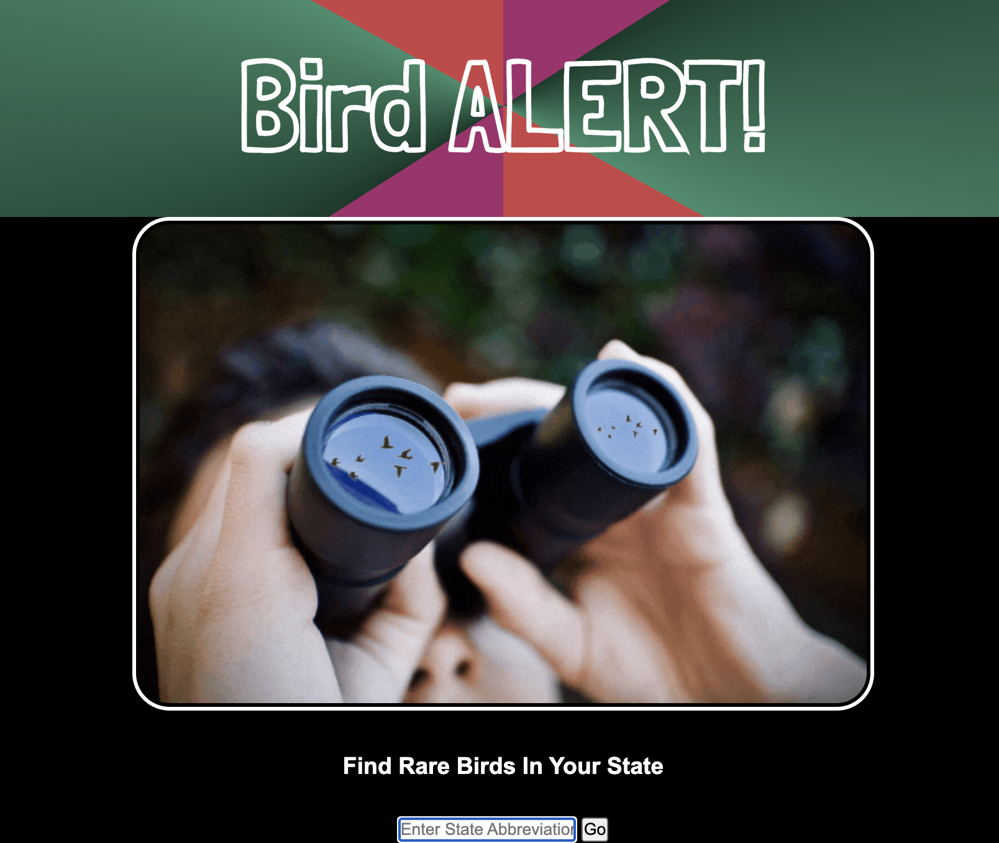
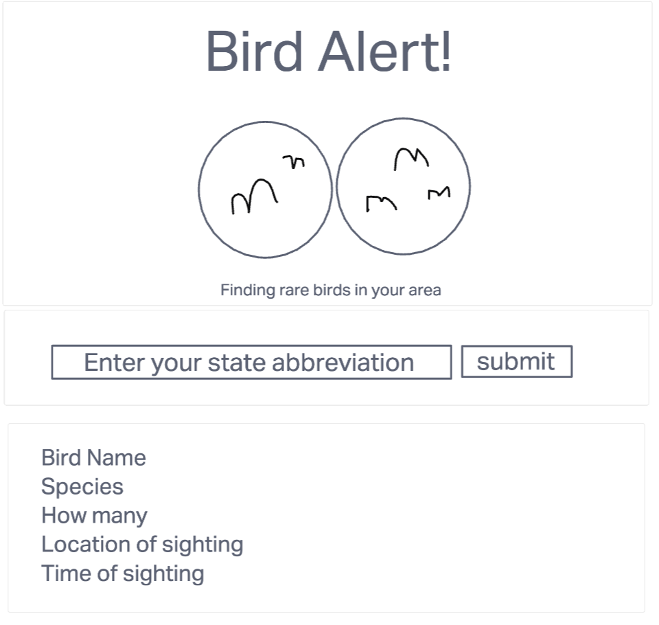

# Bird Alert!

#### A full-stack web application to access rare birds sighted in your state

## Description
User can enter their state abbreviation to populate a list of rare/notable birds reported in that area. User will be able to see species name, location, time of sighting, date of observation, how many were seen, and if the sighting was verified or not.

## Table of Contents

* [Technologies Used](#technologiesused)
* [Features](#features)
* [Design](#design)
* [Project Next Steps](#nextsteps)
* [Deployed App](#deployment)
* [About the Author](#author)

## Technologies Used
* HTML5
* CSS3
* JavaScript
* jQuery
* Google Fonts
* ebird API 2.0

## Features
Users can display a list of rare/notable bird species sighted in their state by typing their state initials into a input bar.

## Wireframe

## Trello Planning
https://trello.com/b/kmPxWhWo/bird-alert

## Design
Design elements implemented using HTML5, CSS3, and google fonts

## Project Next Steps
* Add more sightings per search
* Use latitude and longitude to find rare bird species closest to user
* Connect weather data api (specifically wind and precipitation) to determine whether it is ideal conditions for migration.

## Deployed Link
https://bird-alert.netlify.app/

## Works Cited:
Paul Chapman, Julian Beard, Bradley Mather

The real MVPs ^ for helping me through some issues and pointing me in the right direction

https://www.codeproject.com/Questions/854010/how-to-send-api-url-with-api-key-auth-as-header-us

For working on how to incorporate my key and make the api connect to the web application

https://fossheim.io/writing/posts/css-text-gradient/

For awesome CSS styling ideas!

https://pixabay.com/images/search/binoculars/

Binoculars image